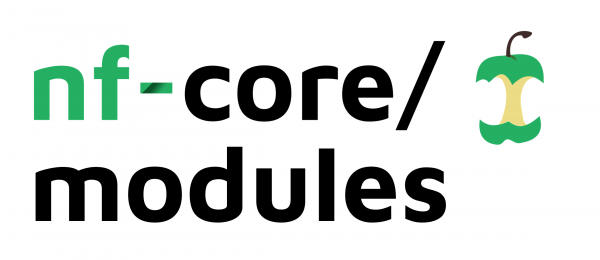

# 

A repository for hosting nextflow [`DSL2`](https://www.nextflow.io/docs/edge/dsl2.htmlhttps://www.nextflow.io/docs/edge/dsl2.html) module files containing tool-specific process definitions and associated documentation.

> DSL2 IS AN EXPERIMENTAL FEATURE UNDER DEVELOPMENT. SYNTAX, ORGANISATION AND LAYOUT OF THIS REPOSITORY MAY CHANGE IN THE NEAR FUTURE!

## Table of contents
* [Using an existing module](#using-an-existing-module)
    * [Configuration and parameters](#configuration-and-parameters)
    * [Offline usage](#offline-usage)
* [Adding a new module](#adding-a-new-module)
    * [Testing](#testing)
    * [Documentation](#documentation)
    * [Uploading to `nf-core/modules`](#uploading-to-nf-coremodules)
* [Help](#help)

## Using an existing module

The Nextflow [`-c`](https://www.nextflow.io/docs/latest/config.html) parameter can be used with nf-core pipelines in order to load custom config files that you have available locally. However, if you or other people within your organisation are likely to be running nf-core pipelines regularly it may be a good idea to use/create a custom config file that defines some generic settings unique to the computing environment within your organisation.

### Configuration and parameters

The config files hosted in this repository define a set of parameters which are specific to compute environments at different Institutions but generic enough to be used with all nf-core pipelines.

All nf-core pipelines inherit the functionality provided by Nextflow, and as such custom config files can contain parameters/definitions that are available to both. For example, if you have the ability to use [Singularity](https://singularity.lbl.gov/) on your HPC you can add and customise the Nextflow [`singularity`](https://www.nextflow.io/docs/latest/config.html#scope-singularity) scope in your config file. Similarly, you can define a Nextflow [`executor`](https://www.nextflow.io/docs/latest/executor.html) depending on the job submission process available on your cluster. In contrast, the `params` section in your custom config file will typically define parameters that are specific to nf-core pipelines.

You should be able to get a good idea as to how other people are customising the execution of their nf-core pipelines by looking at some of the config files in [`nf-core/modules`](https://github.com/nf-core/modules/tree/master/conf).

### Offline usage

If you want to use an existing config available in `nf-core/modules`, and you're running on a system that has no internet connection, you'll need to download the config file and place it in a location that is visible to the file system on which you are running the pipeline. Then run the pipeline with `--custom_config_base`
or `params.custom_config_base` set to the location of the directory containing the repository files:

```bash
## Download and unzip the config files
cd /path/to/my/modules
wget https://github.com/nf-core/modules/archive/master.zip
unzip master.zip

## Run the pipeline
cd /path/to/my/data
nextflow run /path/to/pipeline/ --custom_config_base /path/to/my/modules/modules-master/
```

Alternatively, instead of using the configuration profiles from this repository, you can run your
pipeline directly calling the single institutional config file that you need with the `-c` parameter.

```bash
nextflow run /path/to/pipeline/ -c /path/to/my/modules/modules-master/conf/my_config.config
```

> Note that the nf-core/tools helper package has a `download` command to download all required pipeline
> files + singularity containers + institutional modules in one go for you, to make this process easier.

## Adding a new config

If you decide to upload your module file to `nf-core/module` then this will ensure that it will be automatically downloaded, and available at run-time to all nf-core pipelines, and to everyone within the community. You will simply have to specify `-profile <config_name>` in the command used to run the pipeline. See [`nf-core/modules`](https://github.com/nf-core/modules/tree/master/conf) for examples.

Please also make sure to add an extra `params` section with `params.config_profile_description`, `params.config_profile_contact` and `params.config_profile_url` set to reasonable values. Users will get information on who wrote the configuration profile then when executing a nf-core pipeline and can report back if there are things missing for example.

### Testing

If you want to add a new custom config file to `nf-core/modules` please test that your pipeline of choice runs as expected by using the [`-c`](https://www.nextflow.io/docs/latest/config.html) parameter.

```bash
## Example command for nf-core/rnaseq
nextflow run nf-core/rnaseq --reads '*_R{1,2}.fastq.gz' --genome GRCh37 -c '[path to custom config]'
```

### Documentation

You will have to create a [Markdown document](https://www.markdownguide.org/getting-started/) outlining the details required to use the custom config file within your organisation. You might orientate yourself using the [Template](docs/template.md) that we provide and filling out the information for your cluster there.

See [`nf-core/modules/docs`](https://github.com/nf-core/modules/tree/master/docs) for examples.

### Uploading to `nf-core/modules`

[Fork](https://help.github.com/articles/fork-a-repo/) the `nf-core/modules` repository to your own GitHub account. Within the local clone of your fork add the custom config file to the [`modules/`](https://github.com/nf-core/modules/tree/master/modules) directory, and the documentation file to the [`docs/`](https://github.com/nf-core/modules/tree/master/docs) directory. Please keep the naming consistent between the module and documentation files e.g. `bwa.nf` and `bwa.md`, respectively.

Commit and push these changes to your local clone on GitHub, and then [create a pull request](https://help.github.com/articles/creating-a-pull-request-from-a-fork/) on the `nf-core/modules` GitHub repo with the appropriate information.

We will be notified automatically when you have created your pull request, and providing that everything adheres to nf-core guidelines we will endeavour to approve your pull request as soon as possible.

## Help

If you have any questions or issues please send us a message on [Slack](https://nf-core-invite.herokuapp.com/).
